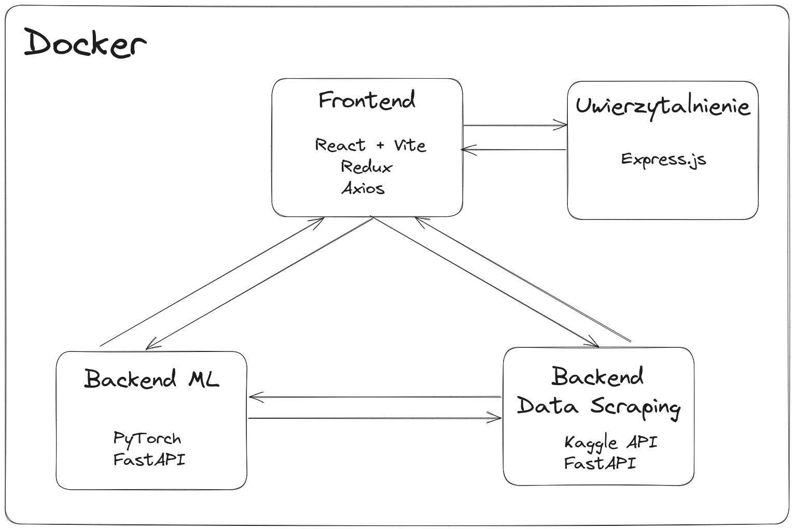

# Strona tytułowa  
  
**Projekt przedmiotu Aplikacje internetowe, Bezpieczeństwo i ochrona danych, wprowadzenie do języka python**  
  
Grupa P5  
  
Krystian Urban  
Filip Walkowicz  
  
# Wstęp  
  
Tematem projektu jest stworzenie serwisu pozwalającego użytkownikowi tworzyć nowe modele uczenia maszynowego, trenować oraz wykonywać na nich predykcje.   Do trenowania modeli dostarczamy użytkownikowi dużo swobody w doborze danych, sam wybiera zbiór danych oraz dopasowuje go pod trening.
  
# Opis architektury serwisu  
  
Strona back-endu podzielona jest na trzy mikroserwisy:  
  
- ML - służący do zarządzania, trenowania i używania modeli,  
- Data scraping - służący do pobierania i przetwarzania zbiorów danych.  
- Uwierzytelnianie - służący do logowania do serwisu
  

  
  
# Opis pojęć  
  
## Architektura  
  
### Mikroserwis  
  
Mikroserwis to odizolowana część aplikacji internetowej, która działa jako samodzielna jednostka. Każdy mikroserwis ma swoją specyficzną funkcję i komunikuje się z innymi mikroserwisami poprzez udostępnione interfejsy. Taka architektura umożliwia łatwiejsze zarządzanie, skalowanie i rozwijanie systemu.
  
### Backend  
  
Backend to część aplikacji internetowej odpowiedzialna za obsługę zapytań wysłanych przez użytkownika, przetwarzanie logiki biznesowej, obsługę bazy danych i inne zadania związane z logiką serwerową.
  
### REST  
  
REST (Representational State Transfer) to styl architektoniczny, który definiuje zasady tworzenia rozproszonych systemów informatycznych. W kontekście aplikacji internetowych, REST opiera się na przesyłaniu danych między klientem a serwerem za pomocą standardowych protokołów komunikacyjnych, takich jak HTTP. Komunikacja oparta na REST jest oparta na zasobach, które są identyfikowane za pomocą URI, a operacje na tych zasobach są określone przez standardowe metody HTTP (GET, POST, PUT, DELETE).
  
## Technologie  
  
### FastAPI  
  
FastAPI to biblioteka w języku Python, która umożliwia łatwe tworzenie REST API. Charakteryzuje się szybkością działania i automatyczną generacją interfejsu API na podstawie adnotacji w kodzie.
  
### PyTorch  
  
PyTorch to biblioteka do uczenia maszynowego w języku Python. Jest wykorzystywana do tworzenia, trenowania i wdrażania modeli uczenia maszynowego. PyTorch oferuje elastyczność i wydajność, zwłaszcza w kontekście głębokich sieci neuronowych.
  
### Requests  
  
Biblioteka `requests` w języku Python służy do wykonywania zapytań HTTP/HTTPS. Pozwala na łatwe komunikowanie się z innymi serwerami poprzez protokół HTTP.

### Axios

Axios to biblioteka w języku JavaScript, służąca do wykonywania zapytań HTTP w środowisku przeglądarki lub na platformie Node.js. Jest powszechnie używana w projektach frontendowych.
### Redux

Redux to biblioteka zarządzania stanem w aplikacjach JavaScript. Jest często stosowana w połączeniu z biblioteką React do zarządzania globalnym stanem aplikacji.

### React

React to biblioteka JavaScript do budowania interfejsów użytkownika. Jest często stosowana w aplikacjach jednostronicowych (SPA) do dynamicznego renderowania widoków.

### Vite

Vite to narzędzie do budowania aplikacji internetowych, które umożliwia szybkie działanie podczas procesu deweloperskiego. Jest często wykorzystywane z frameworkiem Vue.js, React lub innymi bibliotekami frontendowymi.

### Tailwind

Tailwind CSS to nowoczesny framework CSS, który umożliwia budowanie interfejsów użytkownika poprzez definiowanie klas bezpośrednio w kodzie HTML. W przeciwieństwie do tradycyjnych predefiniowanych stylów, Tailwind pozwala na elastyczne dostosowywanie wyglądu elementów poprzez kombinowanie klas.
  
# Założenia  
  
## Ogólne  
  
Cały serwis powinien udostępniać użytkownikowi swoją funkcjonalność po autoryzacji przy pomocy osobnej usługi.  
  
## ML  
  
Serwis powinien pozwalać na tworzenie, zapisywanie, wczytywanie i trening modeli uczenia maszynowego o zdefiniowanej ogólnej strukturze:  
  
- sieć neuronowa,  
- konwolucyjna sieć neuronowa,  
- modele bezpośrednio zaimplementowane w bibliotece *PyTorch*.  
  
Trening powinien odbywać się przy pomocy zbioru danych pobranego z mikroserwisu Data Scraping.  
  
## Data Scraping  
  
Serwis powinien pozwalać na pobieranie zbiorów danych z serwisu Kaggle oraz prostą modyfikację ich poprzez wycięcie kolumn i zaznaczenie podziału kolumn na wejściowe/wyjściowe.  
  
## Uwierzytelnianie 

## Frontend

Frontend powinien dostarczyć intuicyjny interfejs użytkownika umożliwiający korzystanie z funkcji serwisu. Interakcje powinny być przyjazne i łatwe do zrozumienia.

### Strona główna
 - Opis serwisu
 - Logowanie

### Zarządzanie modelem
- Tworzenie nowego modelu
- Przeglądanie dostępnych modeli

### Pobieranie danych
- Pobieranie danych z Kaggle
- Modyfikacja pobranych danych

# Wykonanie  
  
## ML  
  
Mikroserwis został wykonany jako serwis REST API przy pomocy biblioteki FastAPI. 
Modele uczenia maszynowego obsługiwane przez serwis są reprezentowane przez klasę `manageableModel` rozszerzające klasę `torch.nn.Module`. Zawiera ona metody zapisu i wczytywania modeli zapisanych jako zbiór plików:  
  
- konfiguracyjnego(w formacie JSON),  
- stanu(w formacie obsługiwanym przez *torch*).

# Konteneryzacja
## Docker

Docker to narzędzie służące do konteneryzacji aplikacji, czyli pakowania jej w izolowany kontener, który zawiera wszystko, co potrzebne do jej uruchomienia - kod źródłowy, zależności, biblioteki, środowisko uruchomieniowe. Kontenery Docker są przenośne i mogą działać na dowolnym systemie obsługującym Docker.

# Uruchamianie aplikacji

## Budowanie obrazów

Aby zbudować obrazy dla każdej usługi, możemy użyć komendy:
```cmd
sudo docker compose build
```
## Uruchamianie aplikacji

Aby uruchomić aplikację, użyj komendy:
```cmd
sudo docker compose up
```