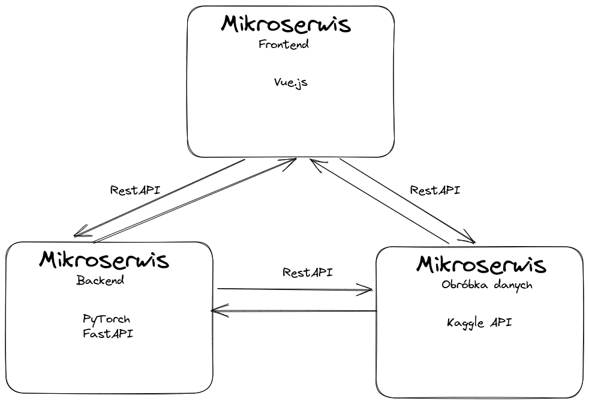

# MultiLearning
# Zarys projektu

Strona internetowa pozwalająca na uruchomienie modeli machine learningu z wykorzystaniem danych: 
- podanych przez użytkownika 
- pobranych ze strony internetowej (web scraping)  

Wykonanie - trzy mikroserwisy: 
- frontend - strona internetowa  
- backend: machine learning - do hostowania modeli ML 
- backend: magazyn danych - przechowywanie i pobieranie danych od użytkownika i ze stron internetowych

Wykorzystane technologie:
- Frontend - Vue(Vite)+typescript
- Backend - Flask/Django
- Magazyn danych - python
