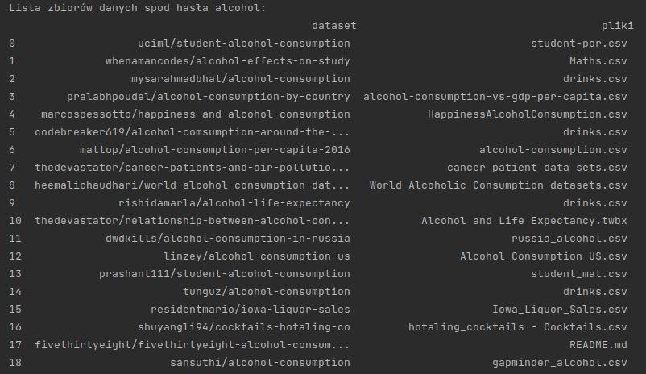
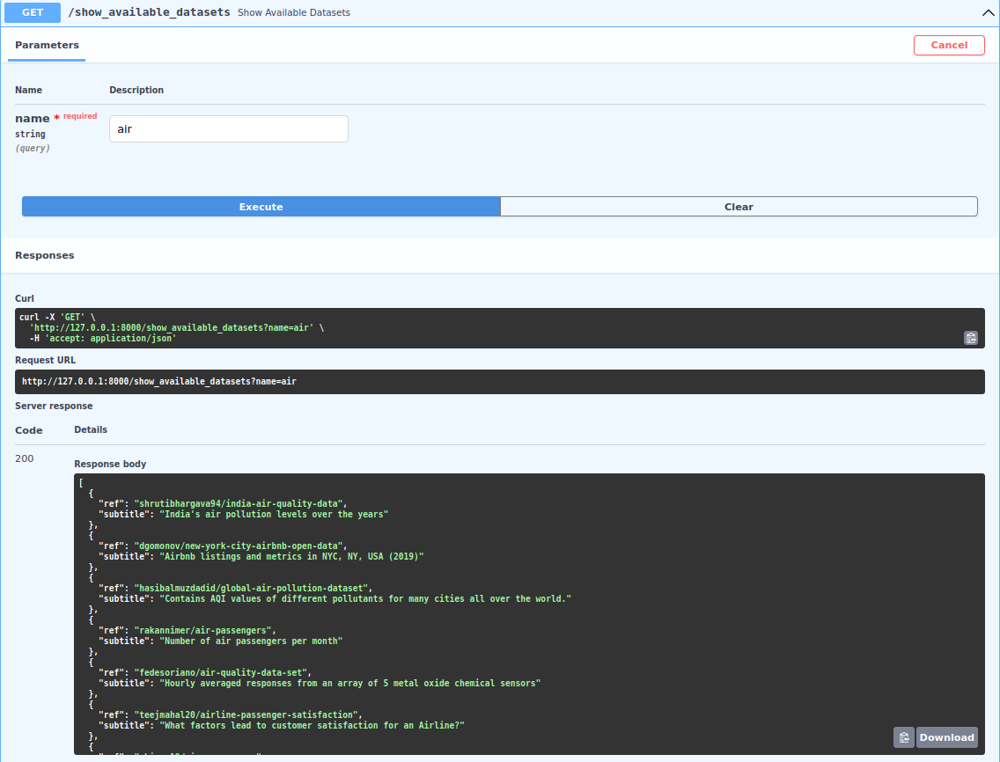
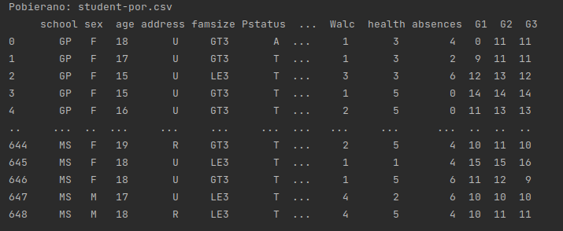
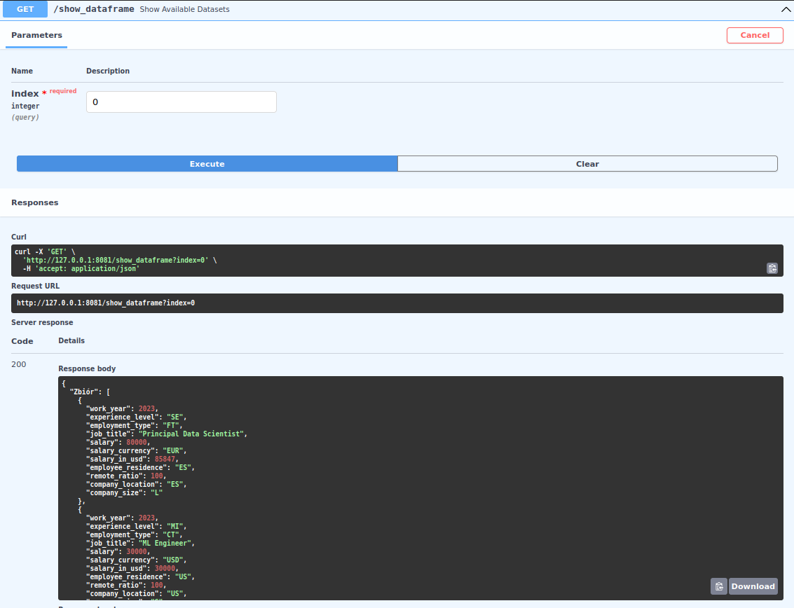
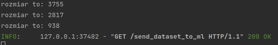
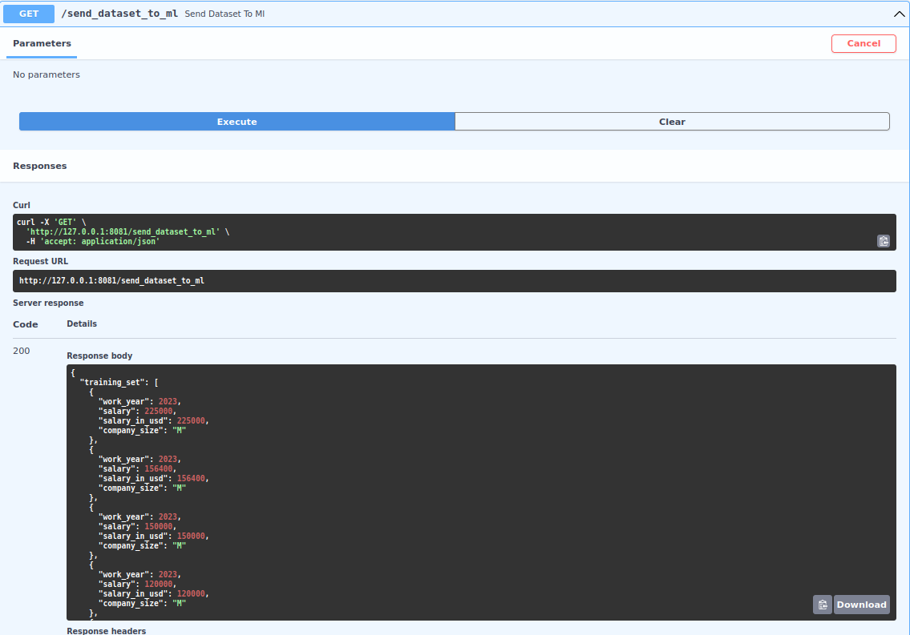
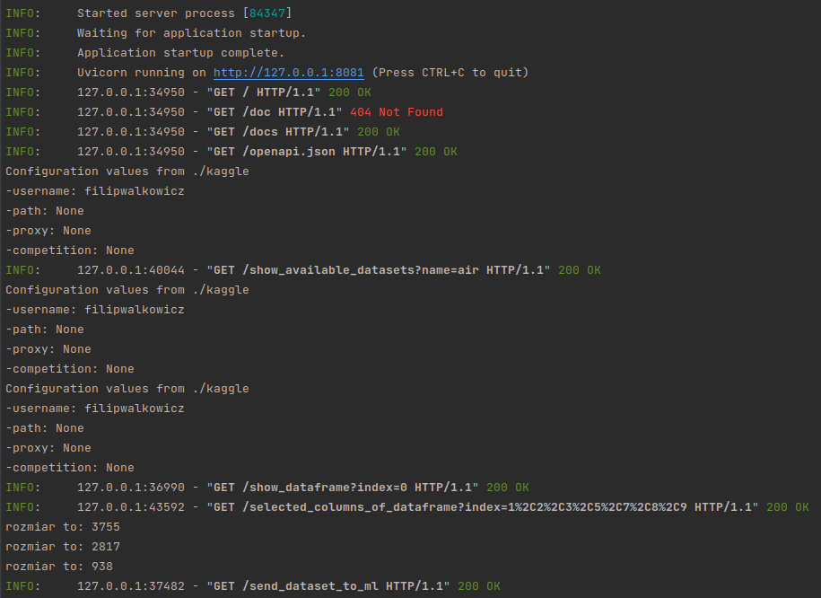

# Backend - pobieranie danych

Mikroserwis odpowiedzialny za dostarczenie danych użytych do treningu modeli ML.

Biblioteki potrzebne do poprawnego działania tego mikroserwisu zostały zapisane w pliku 
`requirements.txt`. Działanie tego mikreserwisu jest możliwe dzięki stronie [Kaggle](https://www.kaggle.com/)
oraz dostarczanego przez nich API. Backend ma za zadanie dostarczyć użytkownikowi następujące możliwości:

- Wpisanie interesującej go frazy i wyszukanie spod niej repozytoriów z plikami
- Wyświetlenie wybranego zbioru danych 
- Obróbka zbioru zgodnie z wytycznymi użytkownika
- Wysłanie zbioru treningowego i tesowego do ML

Wszystkie funkcje wykorzystane do tworzenia projektu zostały opisane podczas ich tworzenia.

---

# Konfiguracja API
Do poprawnego działania mikroserwisu będziemy potrzebowali klucza API Kaggle. Domyślna lokalizacja
to `~/.local/bin`, lecz na potrzeby tego projektu zostanie ona zmieniona. 
```python
os.environ["KAGGLE_CONFIG_DIR"] = "./kaggle"
```
Teraz musimy tylko zainicjalizować API:
```python
api = KaggleApi()
api.authenticate()
```

---

# Wyszukanie zbioru danych
Na początku użytkownik wpisuje interesujący go temat, następnie wysyłane jest zapytanie do kaggle
które zwraca listę zbiorów danych z podanego tematu.



Taka ramka danych zostanie przesłana do strony internetowej dzięki Rest API. Użytkownik naszeg
serwisu będzie widział nazwę zbioru oraz skrócony opis co się w nim znajduje.



Wszystkie funkcje potrzebne do wykonania tego zostały napisane w pliku `search_dataset_kaggle.py`.

---

# Pobieranie Dataset'u

Gdy użytkownik wybierze interesujący go zbiór, który 
zostanie pobrany i wyświetlony do podglądu. W tym momencie zostanie dana możliwość do wyboru
kolumn, które mają być usunięte.






---

# Wysyłanie dataset'u do modelu
W tej części użytkownik już skonfigurował zbiór danych i zostało tylko przesłanie go do 
modelu uczenia maszynowego. Zbiór zostanie podzielony na treningowy i testowy w proporcjach odpowiednio
3/4 oraz 1/4.




Wysyłanie do backend'u uczenia maszynowego:



---

# RESTAPI
Komunikacja pomiędzy mikroserwisami jest przeprowadzona z wykorzystaniem FastAPI.
Wszystkie funkcje zostały napisane w pliku `main_kaggle.py`.

